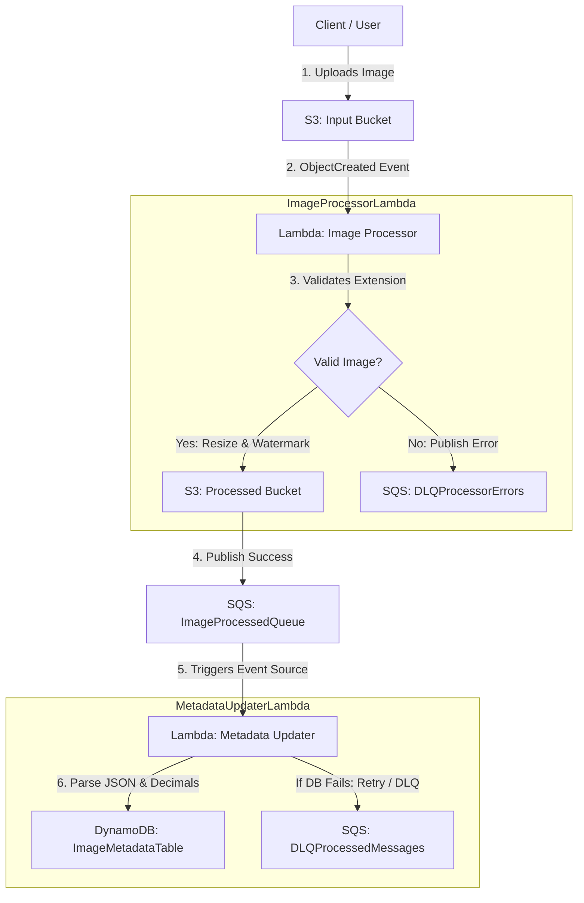

# Serverless Event-Driven Image Processing Pipeline

This project implements a fully serverless, event-driven image processing pipeline deployed on AWS. It automates image validation, resizing, watermarking, success notifications, dead-letter queue (DLQ) error routing, and metadata persistence into DynamoDB.

For local development and testing, the entire AWS infrastructure is orchestrated using **LocalStack** and **Docker Compose**, allowing you to deploy and verify the system end-to-end without incurring real AWS costs.

---

## Architecture Overview



### Components

1. **Input S3 Bucket (`input-image-bucket-<unique-id>`)**: Receives the raw images uploaded by users.
2. **Image Processor Lambda (`ImageProcessorLambda-<unique-id>`)**:
   - Triggered automatically by S3 ObjectCreated notifications.
   - Validates file format (allows `.jpg`, `.jpeg`, `.png`).
   - Downloads, resizes preserving aspect ratio, and adds a text watermark using the `Pillow` library.
   - Uploads the processed image to the processed S3 bucket.
   - Sends success metadata to `ImageProcessedQueue` SQS or failure info to `DLQProcessorErrors` DLQ.
3. **Processed S3 Bucket (`processed-image-bucket-<unique-id>`)**: Receives the resized, watermarked output images.
4. **Image Processed Queue (`ImageProcessedQueue-<unique-id>`)**: Receives JSON metadata payloads upon successful processing.
5. **Metadata Updater Lambda (`MetadataUpdaterLambda-<unique-id>`)**:
   - Triggered by new SQS messages in `ImageProcessedQueue`.
   - Parses the payload (safely deserializing numeric values to Python Decimal format).
   - Writes metadata to DynamoDB.
6. **DynamoDB Table (`ImageMetadataTable-<unique-id>`)**: Stores record metadata (original key, processed key, processing duration, timestamp, dimensions).
7. **SQS Dead Letter Queues (DLQs)**:
   - `DLQProcessorErrors-<unique-id>`: Captures validation/processing failures from the Image Processor Lambda.
   - `DLQProcessedMessages-<unique-id>`: Captures message handling/db-save failures from the Metadata Updater Lambda (configured with SQS redrive policy).

---

## Project Structure

```
├── .env                  # Configuration variables
├── .env.example          # Sample environment configuration
├── deploy.py             # Automation deployment and packaging script
├── docker-compose.yml    # LocalStack orchestrator
├── infra/
│   └── main.yaml         # CloudFormation AWS Infrastructure Template
├── src/
│   ├── image_processor/  # Image Processor Lambda code and unit tests
│   │   ├── app.py
│   │   ├── requirements.txt
│   │   └── tests/
│   │       └── test_processor.py
│   └── metadata_updater/ # Metadata Updater Lambda code and unit tests
│       ├── app.py
│       ├── requirements.txt
│       └── tests/
│           └── test_updater.py
└── tests/
    └── e2e_test.py       # End-to-End integration test script
```

---

## Prerequisites

Ensure you have the following installed on your system:
- **Python 3.12+**
- **Docker** and **Docker Compose**
- **AWS CLI** (for manual verification commands)

---

## Configuration

Duplicate `.env.example` to `.env` and configure your settings:
```ini
UNIQUE_ID=gowri-surya
TARGET_WIDTH=200
WATERMARK_TEXT=© MyCompany
AWS_DEFAULT_REGION=us-east-1
LOCALSTACK_ENDPOINT=http://localhost:4566
```

---

## Deployment Instructions

The deployment process is automated using `deploy.py`. This script:
1. Installs Lambda dependencies for the Linux runtime environment (using Python `--platform manylinux2014_x86_64` compatibility wheels to ensure Pillow runs inside LocalStack container lambdas).
2. Archives the functions into `.zip` files.
3. Spins up LocalStack using `docker-compose` and waits until S3, SQS, DynamoDB, Lambda, and CloudFormation services are healthy.
4. Uploads deployment packages to S3 and deploys the CloudFormation stack.

To deploy, simply run:
```bash
python deploy.py
```

---

## Testing & Verification

### 1. Run Unit Tests
Unit tests use unittest and mocks to test function logic isolation:
```bash
# Test Image Processor Lambda logic
python -m unittest src/image_processor/tests/test_processor.py

# Test Metadata Updater Lambda logic
python -m unittest src/metadata_updater/tests/test_updater.py
```

### 2. Run End-to-End (E2E) Integration Tests
The E2E test validates the live event-driven flow:
- Generates a test PNG image programmatically.
- Uploads it to the S3 input bucket.
- Polls S3 processed bucket for the output image and verifies resizing.
- Polls DynamoDB table for the metadata record and verifies the schema.
- Uploads an invalid text file to check SQS DLQ routing.

To run:
```bash
python tests/e2e_test.py
```

---

## Manual Verification CLI Commands

You can interact with the local cloud services using `aws-cli` pointing to the LocalStack endpoint:

- **List S3 Buckets**:
  ```bash
  aws --endpoint-url=http://localhost:4566 s3 ls
  ```
- **List SQS Queues**:
  ```bash
  aws --endpoint-url=http://localhost:4566 sqs list-queues
  ```
- **View DynamoDB Table Items**:
  ```bash
  aws --endpoint-url=http://localhost:4566 dynamodb scan --table-name ImageMetadataTable-gowri-surya
  ```
- **Check CloudWatch Logs for Lambdas**:
  ```bash
  aws --endpoint-url=http://localhost:4566 logs filter-log-events --log-group-name /aws/lambda/ImageProcessorLambda-gowri-surya
  ```
